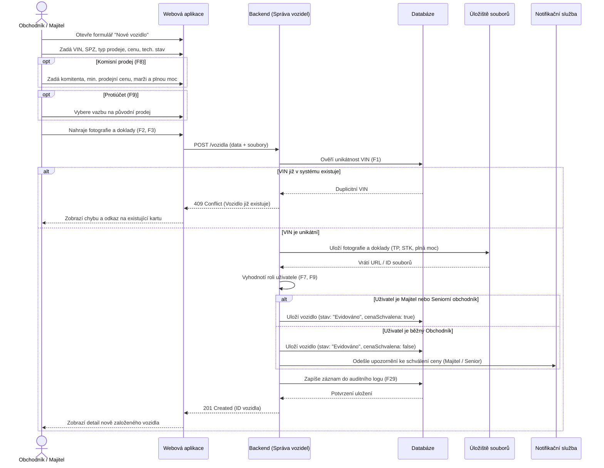
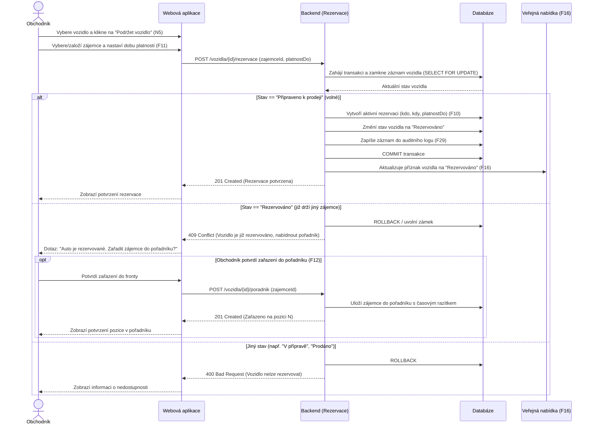
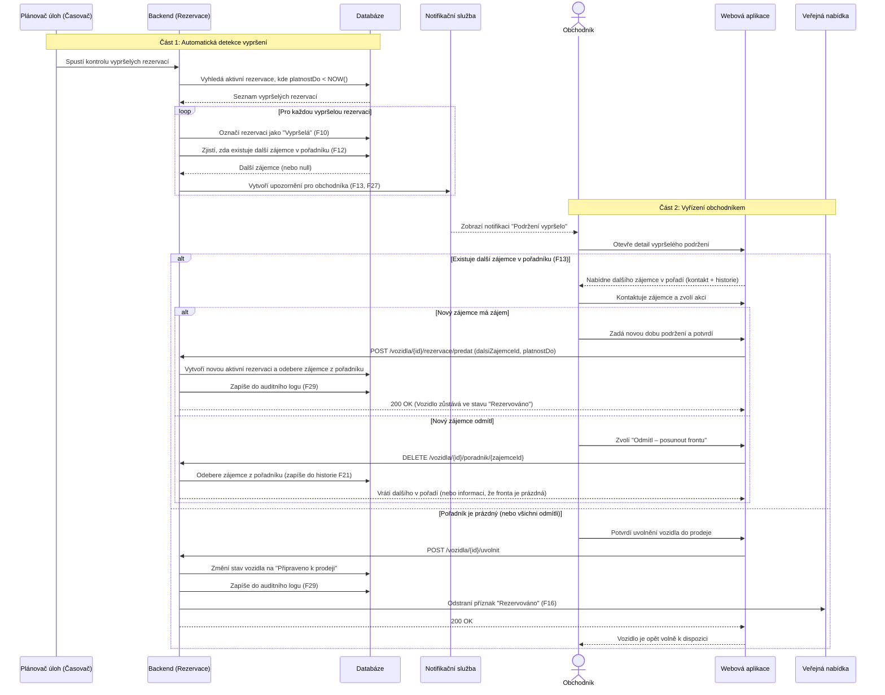

# Sekvenční diagramy – Autobazar

## 1. Založit vozidlo

```mermaid
sequenceDiagram
    actor Obchodnik as Obchodník / Majitel
    participant UI as Webová aplikace
    participant API as Backend (Správa vozidel)
    participant DB as Databáze
    participant Storage as Úložiště souborů
    participant Notif as Notifikační služba

    Obchodnik->>UI: Otevře formulář "Nové vozidlo"
    Obchodnik->>UI: Zadá VIN, SPZ, typ prodeje, cenu, tech. stav
    
    opt Komisní prodej (F8)
        Obchodnik->>UI: Zadá komitenta, min. prodejní cenu, marži a plnou moc
    end
    opt Protiúčet (F9)
        Obchodnik->>UI: Vybere vazbu na původní prodej
    end

    Obchodnik->>UI: Nahraje fotografie a doklady (F2, F3)
    UI->>API: POST /vozidla (data + soubory)
    API->>DB: Ověří unikátnost VIN (F1)

    alt VIN již v systému existuje
        DB-->>API: Duplicitní VIN
        API-->>UI: 409 Conflict (Vozidlo již existuje)
        UI-->>Obchodnik: Zobrazí chybu a odkaz na existující kartu
    else VIN je unikátní
        API->>Storage: Uloží fotografie a doklady (TP, STK, plná moc)
        Storage-->>API: Vrátí URL / ID souborů
        API->>API: Vyhodnotí roli uživatele (F7, F9)
        alt Uživatel je Majitel nebo Seniorní obchodník
            API->>DB: Uloží vozidlo (stav: "Evidováno", cenaSchvalena: true)
        else Uživatel je běžný Obchodník
            API->>DB: Uloží vozidlo (stav: "Evidováno", cenaSchvalena: false)
            API->>Notif: Odešle upozornění ke schválení ceny (Majitel / Senior)
        end
        API->>DB: Zapíše záznam do auditního logu (F29)
        DB-->>API: Potvrzení uložení
        API-->>UI: 201 Created (ID vozidla)
        UI-->>Obchodnik: Zobrazí detail nově založeného vozidla
    end
```

## 2. Podržet vozidlo pro zájemce

```mermaid
sequenceDiagram
    actor Obchodnik as Obchodník
    participant UI as Webová aplikace
    participant API as Backend (Rezervace)
    participant DB as Databáze
    participant Web as Veřejná nabídka (F16)

    Obchodnik->>UI: Vybere vozidlo a klikne na "Podržet vozidlo" (N5)
    Obchodnik->>UI: Vybere/založí zájemce a nastaví dobu platnosti (F11)
    UI->>API: POST /vozidla/{id}/rezervace (zajemceId, platnostDo)
    API->>DB: Zahájí transakci a zamkne záznam vozidla (SELECT FOR UPDATE)
    DB-->>API: Aktuální stav vozidla

    alt Stav == "Připraveno k prodeji" (volné)
        API->>DB: Vytvoří aktivní rezervaci (kdo, kdy, platnostDo) (F10)
        API->>DB: Změní stav vozidla na "Rezervováno"
        API->>DB: Zapíše záznam do auditního logu (F29)
        API->>DB: COMMIT transakce
        API->>Web: Aktualizuje příznak vozidla na "Rezervováno" (F16)
        API-->>UI: 201 Created (Rezervace potvrzena)
        UI-->>Obchodnik: Zobrazí potvrzení rezervace
    else Stav == "Rezervováno" (již drží jiný zájemce)
        API->>DB: ROLLBACK / uvolní zámek
        API-->>UI: 409 Conflict (Vozidlo je již rezervováno, nabídnout pořadník)
        UI-->>Obchodnik: Dotaz: "Auto je rezervované. Zařadit zájemce do pořadníku?"
        
        opt Obchodník potvrdí zařazení do pořadníku (F12)
            Obchodnik->>UI: Potvrdí zařazení do fronty
            UI->>API: POST /vozidla/{id}/poradnik (zajemceId)
            API->>DB: Uloží zájemce do pořadníku s časovým razítkem
            API-->>UI: 201 Created (Zařazeno na pozici N)
            UI-->>Obchodnik: Zobrazí potvrzení pozice v pořadníku
        end
    else Jiný stav (např. "V přípravě", "Prodáno")
        API->>DB: ROLLBACK
        API-->>UI: 400 Bad Request (Vozidlo nelze rezervovat)
        UI-->>Obchodnik: Zobrazí informaci o nedostupnosti
    end
```

## 3. Vyřídit vypršelé podržení

```mermaid
sequenceDiagram
    participant Cron as Plánovač úloh (Časovač)
    participant API as Backend (Rezervace)
    participant DB as Databáze
    participant Notif as Notifikační služba
    actor Obchodnik as Obchodník
    participant UI as Webová aplikace
    participant Web as Veřejná nabídka

    Note over Cron,DB: Část 1: Automatická detekce vypršení
    Cron->>API: Spustí kontrolu vypršelých rezervací
    API->>DB: Vyhledá aktivní rezervace, kde platnostDo < NOW()
    DB-->>API: Seznam vypršelých rezervací

    loop Pro každou vypršelou rezervaci
        API->>DB: Označí rezervaci jako "Vypršelá" (F10)
        API->>DB: Zjistí, zda existuje další zájemce v pořadníku (F12)
        DB-->>API: Další zájemce (nebo null)
        API->>Notif: Vytvoří upozornění pro obchodníka (F13, F27)
    end

    Note over Obchodnik,Web: Část 2: Vyřízení obchodníkem
    Notif-->>Obchodnik: Zobrazí notifikaci "Podržení vypršelo"
    Obchodnik->>UI: Otevře detail vypršelého podržení

    alt Existuje další zájemce v pořadníku (F13)
        UI-->>Obchodnik: Nabídne dalšího zájemce v pořadí (kontakt + historie)
        Obchodnik->>UI: Kontaktuje zájemce a zvolí akci
        alt Nový zájemce má zájem
            Obchodnik->>UI: Zadá novou dobu podržení a potvrdí
            UI->>API: POST /vozidla/{id}/rezervace/predat (dalsiZajemceId, platnostDo)
            API->>DB: Vytvoří novou aktivní rezervaci a odebere zájemce z pořadníku
            API->>DB: Zapíše do auditního logu (F29)
            API-->>UI: 200 OK (Vozidlo zůstává ve stavu "Rezervováno")
        else Nový zájemce odmítl
            Obchodnik->>UI: Zvolí "Odmítl – posunout frontu"
            UI->>API: DELETE /vozidla/{id}/poradnik/{zajemceId}
            API->>DB: Odebere zájemce z pořadníku (zapíše do historie F21)
            API-->>UI: Vrátí dalšího v pořadí (nebo informaci, že fronta je prázdná)
        end
    else Pořadník je prázdný (nebo všichni odmítli)
        Obchodnik->>UI: Potvrdí uvolnění vozidla do prodeje
        UI->>API: POST /vozidla/{id}/uvolnit
        API->>DB: Změní stav vozidla na "Připraveno k prodeji"
        API->>DB: Zapíše do auditního logu (F29)
        API->>Web: Odstraní příznak "Rezervováno" (F16)
        API-->>UI: 200 OK
        UI-->>Obchodnik: Vozidlo je opět volně k dispozici
    end
```
